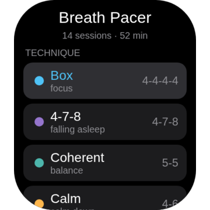
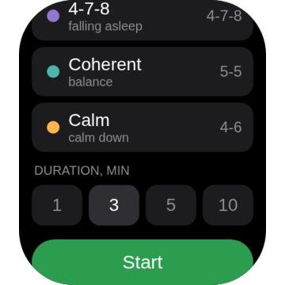
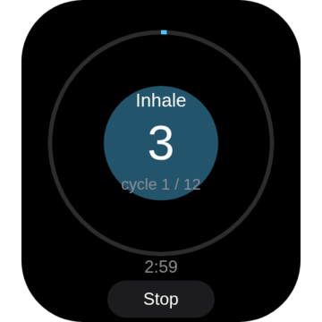
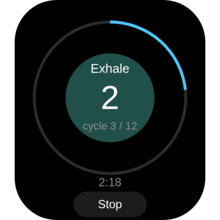
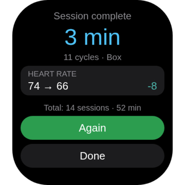

# Breath Pacer

Breathing exercises for Zepp OS watches. A circle on the screen sets the pace and
the watch buzzes on every phase change, so you can shut your eyes instead of
staring at the display.

Built for my own Amazfit GTS 4 (390×450, deviceSource 7995648 and 7995649).
Not tested on anything else.

It never touches the network — no requests, no app-side component. Whatever it
counts stays on the watch.

[По-русски](README.ru.md)

| | | | | |
|:--:|:--:|:--:|:--:|:--:|
|  |  |  |  |  |
| technique | duration | inhale | exhale | summary |

Frames come from the `tools/sim` harness, not off the watch itself.

## How it's put together

Three screens: `page/home.js` picks the technique and duration and carries the
running totals, `page/session.js` is the session itself with the animation,
haptics and heart rate, `page/result.js` shows the summary.

The breathing cycle lives on its own in `utils/breathing.js` and deliberately
doesn't import `@zos/*`, purely so it can run under plain Node. Next to it sit
`utils/constants.js` (techniques, colours, screen geometry) and `utils/store.js`
(settings and stats in `localStorage`). The en-US and ru-RU strings are in
`page/i18n/*.po`, the manifest is `app.json`.

Four techniques so far:

| id | inhale-hold-exhale-hold | what for |
|---|---|---|
| `box` | 4-4-4-4 | focus |
| `relax` | 4-7-8 | falling asleep |
| `coherent` | 5-0-5-0 | steady baseline |
| `calm` | 4-0-6-0 | calm down fast |

Zero holds get dropped, so 4-7-8 runs as a three-step cycle rather than a four-step one.

## Development

```bash
npm test              # breathing engine and bounds checks, 55 assertions
zeus build            # .zab lands in dist/
zeus prune --ip       # mandatory, see below
zeus login            # with a Zepp account, once
zeus preview          # QR code, scan it in the Zepp phone app
```

Tests run under plain Node because `utils/breathing.js` and `utils/constants.js`
don't pull in `@zos/*`. They cover pattern parsing, phase boundaries, wrap-around,
junk on the way in (`NaN`, `±Infinity`, negatives, 400-digit numbers, non-arrays),
the circle-radius invariant and the system-clock jump clamp.

There is no simulator for Linux, so checking anything means a real watch over
`zeus preview`. Developer mode lives in the Zepp phone app: Profile, then tap the
version number a few times.

### Don't forget `zeus prune --ip`

The biggest trap in this project. By default the `.zab` carries an `.ip-package`
inside — a plain unencrypted zip holding the entire source, `README.md` and
`PRIVACY.md` included. I unpacked one to be sure: without prune the package is
55.6 KB, after it 18.1 KB, and all that's left inside is bytecode.

Which gives a simple rule: treat the project directory as publishable. Anything
dropped here that doesn't start with a dot ships to Zepp on the next build, the
one time you forget to prune.

There is a price. Zepp can no longer re-adapt the package to new watch models on
its own, so every model has to be built by hand.

## Publishing

Register the app at https://console.zepp.com/ under *Create App* and put the appId
you get back into `app.json` (the template ships `21816`). Then `zeus build`, take
the `.zab` out of `dist/` and upload it to the console.

What the form asks for:

- a 240×240 PNG icon on a transparent background, kept in the repo root as `store-icon-240.png`;
- at least three 360×360 PNG screenshots, in `store/`, generated by the harness;
- name and description, where en-US is required and ru-RU is already in `app.json`;
- a privacy policy, full text in `PRIVACY.md`;
- permissions: heart rate (`data:user.hd.heart_rate`) and local storage.

Then *Submit for Approval* and wait, review takes one to five working days. All the
copy for the submission form is collected in `STORE.md`, so none of it has to be
written from scratch a second time.

Both the store description and `PRIVACY.md` carry a deliberate disclaimer that this
is not a medical device: heart rate is shown for reference and nothing more.

A new version goes out through *Version Upgrade*, after bumping `version.code` and
`version.name` in `app.json`.

## Things that already went wrong

The code went through two reviews, AppSec and a pentest. Here is what settled into
it as a result, and what is better left alone:

- The time delta is clamped through `MAX_DELTA_MS` in `page/session.js`. Progress is
  measured off `Date.now()`, and without the clamp a clock change, DST or an NTP
  correction mid-session either finished the session instantly or produced a circle
  radius of −309 against a valid 46…136 and hung the screen for an hour.
- The heart rate sensor is switched off first thing in `onDestroy`, and every cleanup
  step sits in its own `try/catch`. Otherwise an exception somewhere in a display call
  left the optical sensor measuring after the app had already exited.
- `pauseDropWristScreenOff` gets a finite duration, never `duration: 0`. Zero means
  "until explicitly reset", so a page that crashed would leave the watch with no
  system screen-off at all.
- `apiVersion` stays at 2.1.0. The code uses `pauseDropWristScreenOff`,
  `resetDropWristScreenOff`, `onCurrentChange` and `offCurrentChange`, all of them
  marked `@version 2.1` in the declarations. Dropping to 2.0.0 will not work.
- Both heart rate readings come from continuous mode. The "before" figure used to
  come from `getLast()`, a single sample possibly hours old, while "after" came from
  `getCurrent()` — and the difference between two different modes was presented as
  the result of the session.
- `validMinutes` guards both ends, reading from storage and parsing router params.
  Without it a negative value decremented the minute counter, and a 400-digit one
  turned into `Infinity` and painted `Infinity:NaN` across the screen.

## Other watch models

You need another key in `targets` shaped `<WxH>-<model>`, an icon at
`assets/<same key>/icon.png` in the matching size, and `platforms` with a
`deviceSource` from the Zeus database in `~/.zepp/.zeus_devices`. Coordinates in the
code are all derived from `SCREEN_W` and `SCREEN_H` in `utils/constants.js`.
